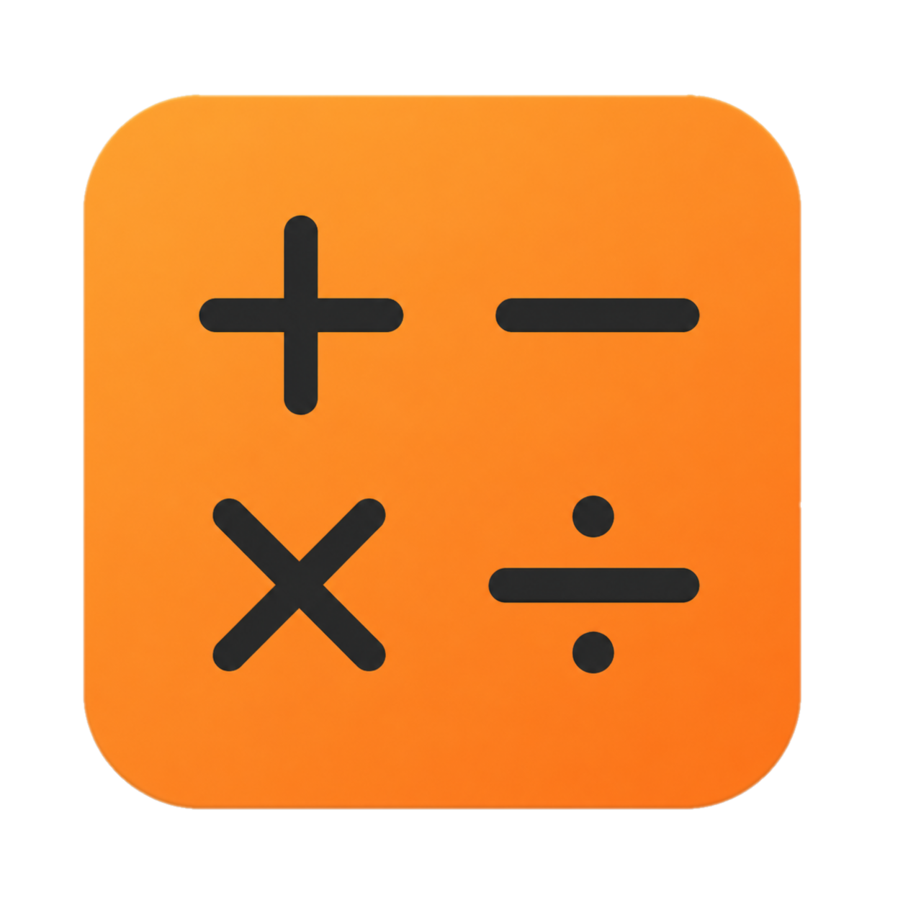

2.projekt předmětu IVS\
Kalkulačka
---------

Tento projekt byl vytvořen v rámci předmětu Praktické aspekty vývoje softwaru  
na Fakultě informačních technologií Vysokého učení technického v Brně.  
  

Prostředí
---------

Ubuntu 64bit

Instalace
------

Autoři
------

Gods of Assembler
- xnaselp00 Petr Nášel 
- xsladed00 David SLádek
- xsirilm00 Michal Širilla 
- xcehlas00 Samuel Cehlárik

Licence
-------

Tento program je svobodný software.
Je licencován pod licencí GNU GPL verze 3 nebo novější.
To znamená, že můžete tento program používat k jakémukoli účelu;
můžete jej studovat a upravovat podle svých potřeb;
a můžete jej i se svými úpravami sdílet s kýmkoli.
Pokud tento program nebo vaše úpravy sdílíte,
musíte příjemcům poskytnout stejnou svobodu,
což zahrnuje sdílení zdrojového kódu pod stejnou licencí.
Podrobnosti najdete na https://www.gnu.org/licenses/gpl-3.0.html
